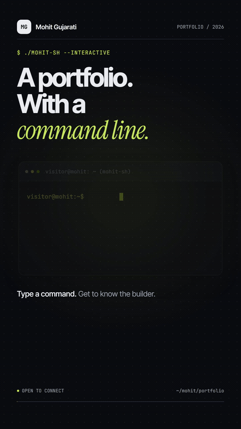

# Mohit Gujarati - Portfolio Website

Welcome to the source code of my personal portfolio! This is a modern, responsive, and highly optimized portfolio built specifically for developers.

<div align="center">
  
</div>

## Live Links
- **Vercel (Primary):** [https://mohit-portfolio.vercel.app](https://mohit-portfolio.vercel.app)
- **GitHub Pages:** [https://mohitgujarati.github.io/Portfoliowebsite](https://mohitgujarati.github.io/Portfoliowebsite)

## Tech Stack
- **Framework:** Next.js (App Router, Static Export)
- **Styling:** Custom CSS, Tailwind CSS (optional)
- **Language:** TypeScript
- **Deployment & CI/CD:** Vercel & GitHub Actions
- **SEO:** Fully optimized with JSON-LD schema, dynamic metadata, and Google Search Console verification.

## Project Structure
- `lib/site.ts`: **The single source of truth.** All my profile information, job experience, projects, skills, and education are stored here.
- `app/page.tsx`: The main page layout that renders the portfolio.
- `app/layout.tsx`: Contains global SEO metadata, fonts, theme settings, and Google Site Verification tags.
- `app/globals.css`: Global styles and light/dark theme variables.
- `components/`: Reusable interactive components like the Nav, Terminal, and Research cards.
- `public/`: Static assets like my resume (`Mohit_Gujarati_Resume.pdf`) and the Open Graph image (`og.png`).

## Local Development
To run this project locally on your machine:

1. **Install dependencies:**
   ```bash
   npm install
   ```
2. **Start the development server:**
   ```bash
   npm run dev
   ```
3. Open [http://localhost:3000](http://localhost:3000) in your browser.

## Automated CI/CD
This repository has two automated workflows:
1. **GitHub Actions (`ci.yml`):** Runs on every Pull Request to ensure there are no TypeScript or build errors.
2. **Vercel Auto-Deploy:** Pushing to the `main` branch automatically triggers Vercel to build and deploy the latest version of the portfolio in seconds.
